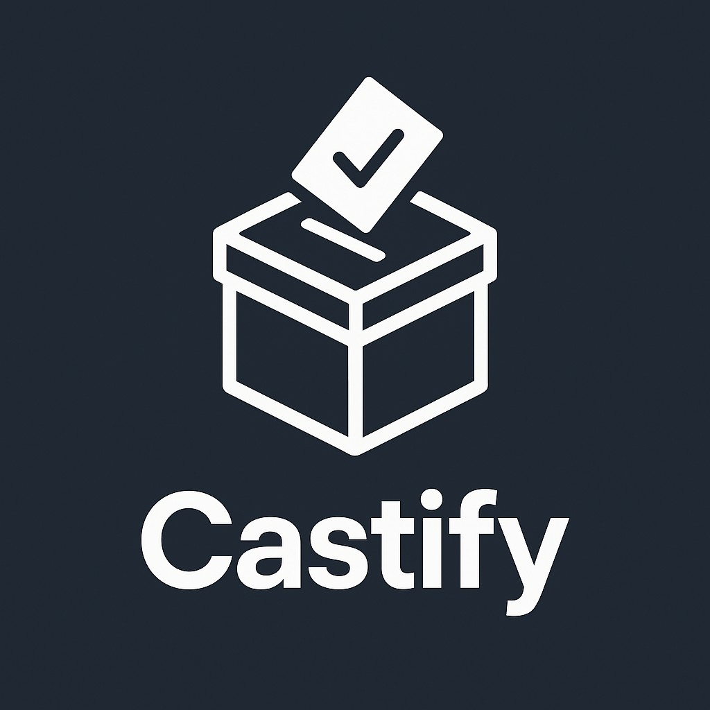

# 🗳️ Castify: CyberElect Voting System



## Empowering Democracy with Transparent, Secure Voting

---

## 📜 Description

**Castify** is a cutting-edge online voting system designed to enhance electoral integrity. By utilizing modern C++ concepts such as **polymorphism**, **inheritance**, and robust **SQL integration**, Castify ensures secure vote recording and transparent counting. Developed in **C++** with a modern **Qt-based GUI**, the system adheres to strict design principles, avoiding dynamic memory libraries (e.g., vectors or maps) to focus on core **Object-Oriented Programming (OOP)** principles.

---

## 🚀 Project Overview

The project is developed in **two distinct phases**:

1. **Phase 1: CLI Version**

   - Implements core logic and SQL database integration for secure data management.

2. **Phase 2: GUI Version**
   - Builds a modern, user-friendly interface using Qt to enhance the overall user experience.

---

## 🎯 Key Features

### 🛡️ Election Integrity & Security

- **Secure Authentication**: Role-based login ensures only registered users can participate.
- **Single Active Election**: Prevents conflicts by allowing only one active election at a time.

### 👥 User Roles & Functionality

#### **Admin**

- Create and manage elections.
- Register candidates and manage user accounts.
- Monitor live voting sessions and view detailed results.

#### **Voter**

- Access current elections and securely cast votes.
- Receive vote confirmations with a built-in **30-second timer** to prevent delays.

#### **Candidate**

- Track live vote counts.
- Review previous voting records.

---

## 💻 Technical Highlights

- **Programming Language**: C++ (C++17 compliant)
- **Database**: Microsoft SQL Server using ODBC Driver 17/18
- **User Interface**: Qt (Phase 2 for a modern GUI experience)
- **OOP Principles**: Inheritance, polymorphism, encapsulation, and abstraction guide the system’s architecture.
- **Additional Functionalities**:
  - Optimized SQL queries.
  - Real-time vote tracking.
  - Visual result representation (charts, tables).

---

## 📚 Resources

- 📄 [Proposal](./docs/OOP%20project%202025.docx)
- 📊 [Rubrics](./docs/Project%20rubrics.docx)
- 🎨 [UI Prototype](https://www.figma.com/design/4TAkBcGWfMdh7wLJoeI5lR/VoteX?node-id=5-30&t=562YBbMyfCeXekkZ-1)
- 📝 [Basic Overview](https://www.figma.com/board/F00b7sXDMT8vUJHH5WSg4F/VoteX?node-id=4-17&t=bkgq5MyKOkhA3Adt-1)

---

## 📁 Directory Structure

```plaintext
Castify/
└── 📁assets
     └── logo.png
└── 📁docs
     └── OOP project 2025.docx
     └── Project rubrics.docx
└── 📁src
     └── 📁gui
         └── .gitkeep
      └── 📁header
         └── Admin.h
         └── Candidate.h
         └── Database.h
         └── Election.h
         └── User.h
         └── Vote.h
         └── Voter.h
     └── main.cpp
     └── 📁source
         └── admin.cpp
         └── candidate.cpp
         └── database.cpp
         └── election.cpp
         └── user.cpp
         └── vote.cpp
         └── voter.cpp
└── .gitignore
└── LICENSE
└── README.md
```

---

## 🔨 Installation & Setup

### Prerequisites

- **Operating System**: Windows 10/11, macOS 11+, or Linux (Ubuntu 20.04+ recommended)
- **Compiler**: C++17 compliant compiler (GCC 9+, Clang 10+, or MSVC 19.20+)
- **Database**: Microsoft SQL Server with ODBC Driver 17/18
- **Qt Framework**: Qt 6.2 or newer (for GUI version)

### Steps to Run (CLI Version)

1. **Clone the Repository**:

   ```bash
   git clone https://github.com/your-repo/Castify.git
   cd Castify
   ```

2. **Database Setup**:

   - Use the provided SQL script (`DB.sql`) to set up your database.
   - Update the ODBC connection settings in `Database.cpp`.

3. **Compile and Run**:

   ```bash
   g++ -o castify main.cpp Database.cpp User.cpp Election.cpp -lodbc32
   ./castify
   ```

### Steps to Run (GUI Version)

1. Open the project in **Qt Creator**.
2. Ensure the appropriate ODBC driver is linked.
3. Build and run the application from within Qt Creator.

---

## 👥 Team

- **Fiza Shahid** – Developer
- **Areej** – Developer
- **Sajid Mehmood** – Developer & Designer

---

## 📖 Documentation & Releases

- Detailed project documentation and reports will be added as the project evolves.
- For the latest updates and changelogs, please check the **Releases** section.

---

## 📜 License

This project is developed for educational purposes to showcase a secure and transparent online voting system.  
© 2025 Castify. All Rights Reserved.
